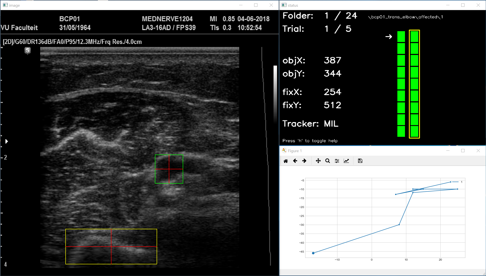

## Ultrasound Image Tracking

This repo contains a python tool for the fast processing of multiple ultrasound image sequences.

The objective is to track the movement of any selected object on the images in relation to a chosen fixpoint. 
The tool utilizes the tracking algorithms implemented in the opencv library. Alternatively
the object can be marked manually on each frame.

**Latest windows build along with sample data in folder ./dist**

If Linux or OSX builds are required, please get in contact with me.

martin.hanewald@gmail.com

